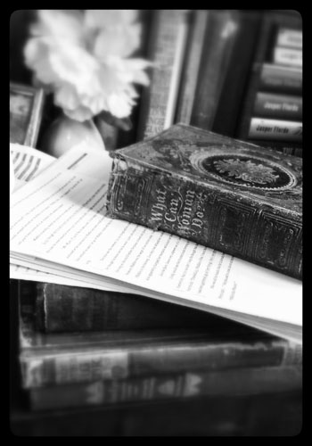

## [by Carly Hayward](http://booklighteditorial.com/team#carly)

“Write drunk, editor sober” is a famous quote with dubious origins. While it is difficult to assign credit to the quote, its message is clear. Writing requires the author to get their creative juices flowing, to awaken their muse, no matter how they do it. But editing requires a stricter, soberer eye. An editor can see things you can’t. 

{.float-left}

All books need an editor, whether you are traditionally or indie-publishing your novel. Writing is an “all in” activity, and maintaining a critical eye can be impossible at times. 

The first type of editor that should look at your book is a **developmental editor** (sometimes known as a substantive editor). They will help you take your manuscript and turn it into the book that _you_ envision. The one that is in your head, that you hoped you put on the paper. They will be your book’s best friend.

A developmental editor is looking for larger issues, not whether you used the correct “you’re” or “your.” They keep an eye out for plot holes, inconsistencies, flow, character development, plot development, hooks, pacing, structure, voice, dialogue, and the list goes on! If you are worried that your character is flat and predictable, they will help you bring them to life. If you can’t seem to come up with a satisfying conclusion, they will tie up all your loose ends and quench your reader’s thirst. A developmental editor will bring your story to light, making sure that certain items aren’t stuck in your head instead of on the page.

It can be difficult to see your book as a reader will. An editor knows how the reader is going to feel, because they are essentially your reader. The main difference between an editor and a reader is that an editor will know how to fix it and how to help you. They know the market, they know the genre, and they know story structure. Beta readers can help to an extent, but they do not always know how to fix problems while still maintaining your voice. Voice is the most important aspect of your book, and you don’t want anyone to stifle it; you want someone to help you nurture and grow it. 

!!!!! "A developmental editor will bring your story to light, making sure that certain items aren’t stuck in your head instead of on the page."

It can be surprising the amount of feedback you get from a developmental editor. It can be scary, but it can also be invigorating. They will breathe life into your book and help it to shine. After working with a developmental editor, you will find that your writing vastly improves in future pieces. They not only grow your book, but they grow your talent. [If you find an editor that is a good fit](/blog/how-to-find-the-right-editor-for-you), you’ll find that your developmental editor really is your book’s best friend. 
 

