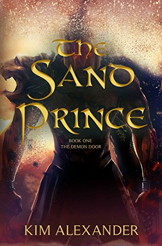

#### by Kim Alexander

###### (This post was originally written for [ITW's The Thrill Begins](http://thrillbegins.com/2016/06/21/the-night-i-danced-with-my-cat/?target=_blank), replublished with permission)

It seemed like such a good idea.

[Forbes agreed](http://www.forbes.com/sites/davidvinjamuri/2014/01/08/how-hybrid-publishers-innovate-to-succeed?target=_blank), and if a company is profiled in Forbes, am I going to argue? I saw the ad for Booktrope on Twitter; they were accepting unagented submissions. I had one of those, and a stack of polite rejection letters from several months of queries.

“Couldn’t hurt, might help,” I said as I hit “send.” I’d done some research and Booktrope appeared to be legit, a new take on publishing, the next big thing. What I’m saying is it wasn’t a pyramid scheme. It was getting funding from [Y-Combinator](https://www.ycombinator.com/?target=_blank), and like I said, Forbes gave them a good review. In January of 2015, I got an acceptance letter. Since they were located in Seattle, I got it after midnight. My cat was the only one awake to dance with me around the living room. He’s an excellent dancer.

Booktrope was indeed a brave new stab at publishing, a hybrid. You got the security of having a publisher backing you while also keeping an unusual amount of autonomy. You interviewed an editor, a cover artist, and a proofreader, signed up a dedicated marketing manager, and a couple of months later you were checking your Amazon ranking every half hour. (Never has something so pointless been so irresistible.) You didn’t get an advance and you paid your team a percentage of the earnings. Sadly, there weren’t enough earnings for the company to stay afloat.

[Booktrope closed their doors on May 31st](http://www.publishersweekly.com/pw/by-topic/industry-news/publisher-news/article/70132-booktrope-to-shut-down-operations.html?target=_blank). Whatever anyone did that was right or wrong, I am forever grateful that they handed our rights back immediately. If they hadn’t I’d be out on a ledge using the pigeons to dry my tears. Pigeons are very absorbent. Instead, this was a cheap lesson and a crash course in what’s important and what you can’t fake. My first blurb was a disaster, my cover, even though I liked it, didn’t speak to my target audience, and most importantly, my book simply wasn’t ready for release. Fortunately, we pulled it before the damage was fatal. That was another lesson. I was too close to my own work to recognize that it needed another run through the editing bay. I needed more oversight and less autonomy.

If I’d gone completely on my own, my book would have sunk beneath the waves and that would have been the end of it. It wasn’t. Booktrope gave me a second chance, a great editor, a new cover, and after many hours of tears and blood, a new blurb. (Launch Two: The Relaunchening.) I learned that there are some aspects of this job I shouldn’t be involved in (I suck at covers), and there are some things I’m just not good at (lookin’ at you, synopsis). I also learned what it’s like to work with an editor and why that’s something to relish, not fear.  I met people who love my characters almost as much as I do, and I even sold some books.

What’s next? I kept my editor, hired a publicist I met through Booktrope, and my novel, [THE SAND PRINCE](https://www.amazon.com/Sand-Prince-Demon-Door-Book-ebook/dp/B01GXFQB6C?target=_blank) goes on sale (again) on June 28th. Third time’s the charm, right? RIGHT? I still don’t have an agent, and I’ve also learned why it’s important to have one. Unpicking the contracts between the authors and their teams was in some cases extremely unpleasant and best left to agents. And even though I am currently an independent author–Captain of my own ship! Master of my own destiny! Keeper of 70% of my royalties!–I would be lying if I said the lure of an established publishing house doesn’t tempt me. One day…

And that’s how I got to launch my debut novel three times in two years.

[Kim Alexander](http://kimalexanderonline.com/wp/?target=_blank) _grew up in the wilds of Long Island, NY and slowly drifted south until she reached Key West. After spending ten years working as a disc jockey in the Keys, she moved to Washington DC, where she reported the traffic and spun the Oldies. After a career upgrade, she became the co-programmer of Sirius XM Book Radio, which gave her the opportunity to interview some of her writing heroes, including Anne Rice, George RR Martin, Neil Gaiman, Stephen King and Margaret Atwood, among many hundreds of others.  She began writing when she ran out of authors to interview (and they pulled the plug on her channel)._

_She currently lives with two cats, an angry fish, and her extremely patient husband close enough to the National Zoo to hear the lions and the monkeys, at least she hopes that’s what those noises are._

To learn more about Kim Alexander’s debut novel, click on the cover below:

