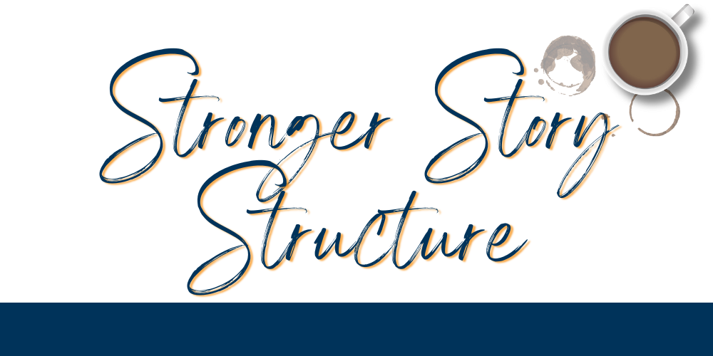

Understanding the structure of your story can be super helpful *before* you start drafting, but regardless of what work you did before, *after* is a great time to review your story's structure and make it **even stronger**. Here are 9 tips to help you revise for stronger story structure! 

Tip 1: **Use a story structure as a framework!** If you didn't draft with one, pick a structure and see how your story aligns with it. If you did draft from a structure, try switching it up by comparing it to a different structure! 

Tip 2: Some story structures to check out: the 3 Act Structure, Save the Cat, Romancing the Beat, the Story Spine, the Heroine's Journey, the Hero's Journey, and Kishōtenketsu.

Tip 3: Check your beginning: **how much can you cut before you have to drop a bunch of exposition on your readers?** Cut it up to that point. 

Tip 4: Once you've written to the end, go back and revise the beginning to echo the climax. 

Tip 5: Triple-check that each plot thread is resolved by the end&mdash;**dangling plot threads don't provide any structural integrity**. 

Tip 6: Read through each scene and make sure it's a consequence of a scene that came before, and that each scene has an impact on the events that follow.

Tip 7: **Make sure each scene moves the plot forward**. If it accomplishes another purpose (expositions, motivations, etc.) then creatively combine it with another scene to keep that forward momentum.

Tip 8: **The stakes should increase as the story goes on**, or else it will feel backwards to readers. Start with the protagonist being late to school and end with them rushing to stop the doomsday device, not the other way around! (Unless you're doing something cool with it.)

Tip 9: **Your novel will feel more powerful when characters change throughout the story**, because that makes it a life-changing narrative… for better or for worse.

 
!!!!! Finally, because story structure encompasses the entire novel, you might be a bit too close to clearly see whether it's holding up. Take a break for a fresh pair of eyes before delving into structural revisions or ask an outside opinion. We'd love to provide that second pair of eyes, so check out our services page if you want to learn more about how we can help.
!!!!! 
!!!!! [Services](/services){.button}