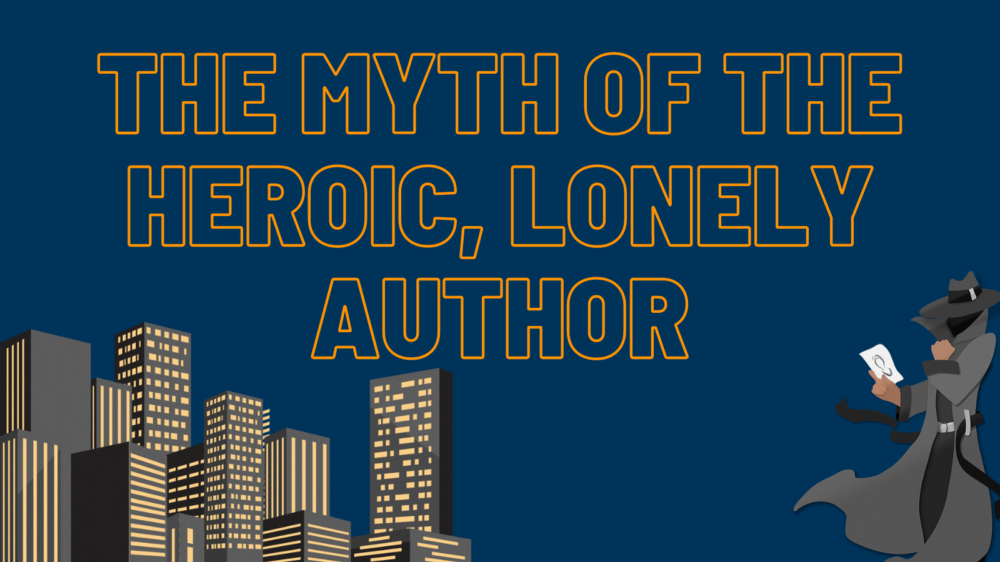

## [By Jessica Nelson](http://booklighteditorial.com/team#jessica)

From the outside, for readers, no myth about publishing is as pervasive as the idea of the writer as an island. The heroic author, toiling alone to create another world made of words. We imagine the satisfied sigh, the tidy stack of pages: the novel is born.  

But if a first completed draft is the birth, then getting the book to readers is more like raising that baby to adulthood. And like with children—reader, it takes a village. 

Recently, the son of spy novelist John Le Carré wrote about [his parents’ working relationship](https://www.theguardian.com/books/2021/mar/13/my-father-was-famous-as-john-le-carre-my-mother-was-his-crucial-covert-collaborator?target=_blank). His father wrote, and his mother performed a blend of developmental and line editing on his draft. They passed the manuscript between them, a dialog of revisions before the book was even handed over for the publisher’s editing process. 

Men of “towering genius” often had wives who typed up their drafts. I wonder how many others had, in reality, an in-house editor behind the curtain. For many authors, a critique group or beta readers act as the sounding board and threshing floor for new pages. A writing community is invaluable in finding what resonates and learning collectively about the craft. 

All of that work is invisible, and far more social than we’ve been led to expect. For most readers, the formal editing process is equally opaque. Developmental editors, copyeditors, proofreaders. Are they glorified typo-spotters, or magicians, or some uncanny being that is neither and both? They are an author’s village.

Developmental editors or book editors look at the big picture. Take _Go Set a Watchman_, Harper Lee’s purported first novel. Although there is some controversy surrounding the publisher’s account, [the tale goes](https://www.vox.com/2015/7/16/8974447/harper-lee-go-set-a-watchman-racism-controversy?target=_blank) that Ms. Lee’s editor took _Go Set a Watchman_ and asked her to write about the main character, Scout, as a child. The result was _To Kill a Mockingbird_. Catch-22 was [taken apart and reassembled](https://www.mentalfloss.com/article/12318/8-great-moments-history-editing?target=_blank) chapter by chapter in the editor’s office. These editors, and the subsequent professionals who work on a manuscript, are collaborators working closely with authors to help their vision shine in its best possible form.

Until you are elbow deep in writing and publishing, you don’t see the many sets of careful eyes that help make a good book great. Forget the misleading and harmful image of the lonely writer churning out a perfect book. A person learns from many teachers and mentors over a lifetime. Give your book the same chance to be great with professional editors like those at Book Light Editorial.