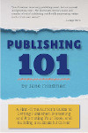

### Other Genres
There are many other genres out there. We can always discuss which genre best fits your novel.
#### Some more genres include:
* Dystopian
* Thriller/Suspense
* Horror
* Literary Fiction
* Historical Fiction
* Magical Realism

##### Disclaimer: 
Many genres overlap and can be subgenres of each other. The above breakdown is not set in stone.  Your novel likely crosses over into multiple genres, but it is important to find the one genre that fits the main plot of your book. 

## Writing Resources {.center}

!!!!! **Grammar Girl - Quick and Dirty Tips:**   
!!!!! {.float-left}
!!!!! This is a wonderful resource for when you can't remember the difference between further and farther, breath and breathe, or your and you're (please tell us you don't mix up your/you're. It will make us very sad).   
!!!!!    
!!!!! You will find almost all of your grammar questions answered here in a simple and easy-to-understand format. 
!!!!! [Check it out here.](http://www.quickanddirtytips.com/grammar-girl?target=_blank)   
!!!!!    
!!!!! **The Editorial Freelancers Association:**   
!!!!! {.float-left}
!!!!! If we aren't a good fit for you (That could never be so! But actually, it is very possible. We'll just have to learn to deal with the disappointment) or you want to learn more about hiring freelance editors, check this site out. It is chockful of great editors and information on what to expect when you are hiring a freelance editor.   
!!!!! [Check it out here.](http://www.the-efa.org/?target=_blank)    
!!!!!    
!!!!! **Revise & Resub Contest:**   
!!!!! {.float-left}
!!!!! This contest says it is all about the editing (and it is), but it is mostly about the community. So many writers and editors come together to discuss writing tips and show their support.   
!!!!!    
!!!!! In this contest, authors will win feedback and full edits on their manuscript from professional editors, ensuring their works are polished and ready for those agent inboxes. Authors will be immersed in a supportive community of their peers, they will also have the chance to learn more about how their story fits into the industry.   
!!!!! [Check it out here.](http://reviseresub.com/?target=_blanl)   
!!!!!   
!!!!! **Jane Friedman:**   
!!!!! {.float-left}
!!!!! Jane Friedman knows everything there is to know about publishing, agents, editors, and the industry as a whole. Anything you've ever wanted to know about the industry from writing query letters to what to expect when working with an editor can be found through her. She has written books on the topic and filled her website full of great tidbits to help you along your way.   
!!!!! [Check it out here.](https://janefriedman.com/?target=_blank)   
!!!!!    
!!!!! **Manuscript Wishlist:**   
!!!!! {.float-left}
!!!!! If you are considering submitting to an agent, Manuscript Wishlist is a great place to start. Most agents will tweet out their manuscript wishlist, which is just the books that they are on the hunt for, using the hashtag #MSWL. Many editors use the hashtag as well. If you don't have time to scour Twitter looking for the perfect #MSWL, this site compiles a lot of them.   
!!!!! [Check it out here.](http://www.manuscriptwishlist.com/?target=_blank)
!!!!!   
!!!!! **Just Publishing:**   
!!!!! {.float-left}
!!!!! If you are considering becoming an indie author or you already are one, this is the site for you. Just Publishing is a blog maintained by Derek Haines, a grumpy, old English teacher, author and habitual blogger, who has a long held interest in self-publishing, as a means of freedom of expression rather than as an avenue to instant riches and fame.   
!!!!! [Check it out here.](http://www.derekhaines.ch/justpublishing/?target=_blank)   
  
