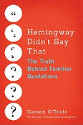

## Writing Resources and Tips{.center}

!!!!! ##### When you are writing and writing or fed up with your writer's block, these resources will answer some of your questions and maybe get you back on track:   
!!!!!    
!!!!! **Grammar Girl - Quick and Dirty Tips:**   
!!!!! {.float-left}
!!!!! This is a wonderful resource for when you can't remember the difference between further and farther, breath and breathe, or your and you're (please tell us you don't mix up your/you're. It will make us very sad).   
!!!!!    
!!!!! You will find almost all of your grammar questions answered here in a simple and easy-to-understand format. She also has a ton of other writing resources to help you procrastinate writing while still being productive.   
!!!!! [Check it out here.](http://www.quickanddirtytips.com/grammar-girl?target=_blank)   
!!!!!    
!!!!! **The Editorial Freelancers Association:**   
!!!!! {.float-left}
!!!!! If we aren't a good fit for you (That could never be so! But actually, it is very possible. We'll just have to learn to deal with the disappointment) or you want to learn more about hiring freelance editors, check this site out. It is chockful of great editors and information on what to expect when you are hiring a freelance editor.   
!!!!! [Check it out here.](http://www.the-efa.org/?target=_blank)   
!!!!!    
!!!!! **The Quote Investigator:**   
!!!!! {.float-left}
!!!!! Are you planning on including a quotation in the book you are writing? Then check out The Quote Investigator. Misinformation about quotations is surprisingly prevalent on the internet. The Quote Investigator website has a collection of pages that examine a variety of common misquotations.   
!!!!!    
!!!!! But mostly, this is a great place to get lost in the history of different famous sayings. You would not believe how many Etsy products or Pinterest sayings are misattributed or even miswritten.   
!!!!! [Check it out here.](http://quoteinvestigator.com/resources/?target=_blank)   

!!!!! ##### Maybe you are done writing, and you've become intrigued by the world of indie-publishing. These resources will help that vision come true:   
!!!!!    
!!!!! **\#ShoreIndie Contest:**   
!!!!! {.float-left}
!!!!! You've decided that indie-publishing is the place for you. You've finished your manuscript and you are ready to dive into the indie-publishing world. The true value in joining contests like these is not the winning but the community you find there. So many authors and editors come together and share tons of advice and support. You'll find lifelong critique and writing partners here!   
!!!!!    
!!!!! \#ShoreIndie supports emerging indie authors by providing quality editing services and book marketing resources, creating a Twitter-based learning community for established as well as emerging indie and hybrid authors.   
!!!!! [Check it out here.](https://shoreindie.blogspot.com/?target=_blank)   
!!!!!    
!!!!! **Just Publishing:**   
!!!!! {.float-left}
!!!!! If you are considering becoming an indie author or you already are one, this is the site for you. Just Publishing is a blog maintained by Derek Haines, a grumpy, old English teacher, author and habitual blogger, who has a long held interest in self-publishing, as a means of freedom of expression rather than as an avenue to instant riches and fame. 
!!!!!    
!!!!! In between irregular novels, he blogs. In a way, it is publishing at its grass roots. Opinion, ideas, advice and crankiness, delivered almost daily.   
!!!!! [Check it out here.](http://www.derekhaines.ch/justpublishing/?target=_blank)   
!!!!!    
!!!!! **WillowRaven Illustration and Design:**   
!!!!! {.float-left}
!!!!! If you are indie publishing you need a great book cover. It is the first thing that draws a reader in, and as much as we hate that it is true, people really do [judge a book by it's cover](/blog/judging-covers).   
!!!!!    
!!!!! Aidana WillowRaven, tradigital artist and mother of three, was trained in Fine Art, Studio Design and Animation at Norfolk State and Old Dominion universities. WillowRaven has worked with several small publishers as well as many, many independent authors. In addition to her freelance business, she is also the Art Director at 4RV Publishing.   
!!!!! [Check it out here.](http://willowraven.weebly.com/?target=_blank)   

!!!!! ##### Maybe your dream is to be traditionally published and/or picked up by a literary agent. Then these resources are for you:   
!!!!!    
!!!!! **Revise & Resub Contest:**   
!!!!! {.float-left}
!!!!! This contest says it is all about the editing (and it is), but it is mostly about the community. So many writers and editors come together to discuss writing tips and show their support.   
!!!!!    
!!!!! In this contest, authors will win feedback and full edits on their manuscript from professional editors, ensuring their works are polished and ready for those agent inboxes. Authors will be immersed in a supportive community of their peers, they will also have the chance to learn more about how their story fits into the industry.   
!!!!! [Check it out here.](http://reviseresub.com/?target=_blanl)   
!!!!!    
!!!!! **Jane Friedman:**   
!!!!! {.float-left}
!!!!! Jane Friedman knows everything there is to know about publishing, agents, editors, and the industry as a whole. Anything you've ever wanted to know about the industry from writing query letters to what to expect when working with an editor can be found through her. She has written books on the topic and filled her website full of great tidbits to help you along your way.   
!!!!! [Check it out here.](https://janefriedman.com/?target=_blank)   
!!!!!    
!!!!! **Manuscript Wishlist:**   
!!!!! {.float-left}
!!!!! If you are considering submitting to an agent, Manuscript Wishlist is a great place to start. Most agents will tweet out their manuscript wishlist, which is just the books that they are on the hunt for, using the hashtag #MSWL. Many editors use the hashtag as well. If you don't have time to scour Twitter looking for the perfect #MSWL, this site compiles a lot of them.   
!!!!! [Check it out here.](http://www.manuscriptwishlist.com/?target=_blank)
