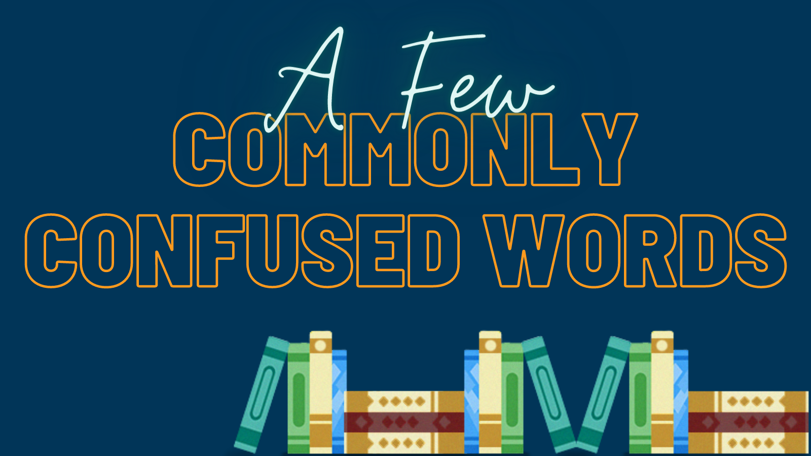

#### [By Jessica Nelson](http://booklighteditorial.com/team#jessica)

I adore a good “commonly confused words” list. Even if I know the answers, I like reading other people’s explanations or seeing which ones make the “greatest hits” like perennial favorites affect/effect and lay/lie/laid.  Below, you’ll find some of the mistakes I see often in the editing trenches but don’t always see on other lists. 

#### Shined/shone

Both of these are past tense of shine—but the word you choose depends on whether someone is applying shine (I **shined** my shoes) or glowing (A lantern **shone** in the distance). The reason this one’s so confusing is that shine can be either transitive (action is <i>trans</i>ferred to the direct object—shoes in this case) or intransitive (no direct object). 

#### Discreet/discrete

A homophone (words that sound the same but have different spelling and meaning) that is easily in my top five. Discreet is the form most often wanted, meaning quiet, unobtrusive, or good at keeping secrets. A **discreet** wink. Discrete merely means separate, like an orchestra seated in **discrete** sections. It also has specific mathematics uses, which I am going to hint at but not attempt to explain. 

#### Mantel/mantle

Another homophone, and another one I see frequently. In the end, dictionaries follow usage. If a mistake persists, the dictionary simply changes. This mix up occurs so often that in another decade or two, we may not have to worry about making a distinction. However, for now, a mantel is the shelf over a fireplace, and mantle is a cloak or a general word for covering. Photos on the **mantel**; but mountains wearing a **mantle** of fog. 

{.float-left}

#### Rise/raise (rose/raised)

Like shone/shined, this one depends on the transitive/intransitive distinction, but they are two distinct words. Rise, past tense rose, is used when something is going up under its own power. I **rose** to my feet or the balloon **rose** over the crowd. Raise is used only when one thing is acting on another. She **raised** the topic or **raised** a baby. To complicate matters further, my hand **rose**, but I **raised** my hand. 

#### Avert/advert

This one is hard! Avert means turn away; advert means refer or turn (eyes or attention) toward and is always used with to. So: I **averted** my eyes from the grisly sight. And: He **adverted** to what had happened earlier; or The committee **adverted** to the next agenda item.

#### Jutted/jetted

Jutted is to stick out, as a cliff or a lower lip. Jetted means hurried, or, more rarely, traveled by jet pack. This one I usually only see mistaken one way: misusing jetted. Example: The castle stood on a cliff ~~jetting~~ jutting out over the ocean. 

#### Scrabbled/scrambled

The definitions of words slide and blur over time, and according to Merriam-Webster, scrabbled is now okay to use interchangeably. However, if you’d like to preserve a distinction, scrabbling is a hand-centric scratching or clawing, where scrambling is a full-body action. A peasant might **scrabble** in the dirt for dropped coins, and then **scramble** out of the path of a horseback aristocrat. 

##### Still not sure? That’s fine, Book Light Editorial has you covered. It’s our job.