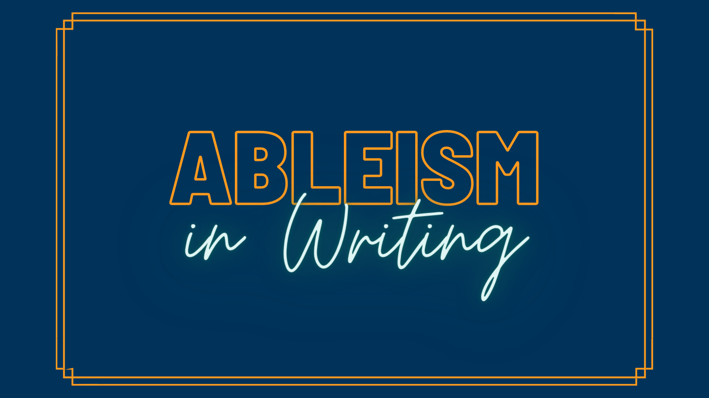

Let’s start with a definition. Ableism in writing is attributing an inferior status to a disabled character and it includes language used within the story (including voice from the author, narrator, and/or character) as well as use of harmful stereotypes within the story. 

Writing has a host of **harmful stereotypes and tropes that need ditching**. Some examples to avoid: 
 * A Magical/Miraculous/Medical intervention that “cures” the disability 
 * Disability Superpowers 
 * The Burden/Beleaguered Sibling Trope 
 * “Sicklit” 

Instead of those harmful tropes and stereotypes, write inclusively. **Make your disabled characters three dimensional and a part of everyday life** (i.e. a lawyer, a neighbor, etc.). Disabled characters can and should have healthy romantic lives. They aren’t just the unsexual friend or inspiring plot point. They are part of your world just as every other character is. They are no different.

Disabled characters shouldn't be in the story to inspire non-disabled characters because of their disability. Can a disabled character be inspiring for a reason outside of their disability? Yes! But don't have it centered on their disability.

When trying to write about a disability you don't experience yourself, consult individuals who have the disability—not just doctors, professionals, etc. Connect with the disabled community. And seriously consider hiring a sensitivity reader or two when done with your story. 

Word choice matters! Use non-ableist language. This is not limited to how a character is physically, emotionally, or psychologically, but in word choice throughout. An example of this would be describing an event as crippling. Instead, use words like difficult, harmful, painful, etc.. Framing and phrasing around disability matters. Don’t use phrases like “afflicted by,” “victim of,” “wheelchair-bound,” “in spite of,” or “stricken with” as it frames disabilities as negative or dangerous. Instead think about using words like “wheelchair-user” or simply state the nature of the disability in a neutral manner (i.e. He/She/They have ...). A wheelchair user isn’t bound to their chair, they are freed by the chair because they are able to move around. For a list of some ableist terms check out: [Ableist words and terms to avoid by Autistic Hoya](https://www.autistichoya.com/p/ableist-words-and-terms-to-avoid.html) and [The Conscious Style Guide](https://consciousstyleguide.com?target=_blank). 

Consider writing about disabled characters who are not only comfortable with, but are proud of and celebrate their disability. 

Writing inclusively not only enriches the writing world as a whole, but, more importantly, brings people who are often left out of stories into worlds they aren’t represented in. This matters for readers of all ages.

!!!!! #### Additional Resources: 
!!!!! 
!!!!! * [Writing the Other](https://writingtheother.com/resources?target=_blank)
!!!!! * [Think Tank for Inclusion & Equity](https://www.writeinclusion.org/factsheets?target=_blank)
!!!!! * [Ableist words and terms to avoid by Autistic Hoya](https://www.autistichoya.com/p/ableist-words-and-terms-to-avoid.html)
!!!!! * [The Conscious Style Guide](https://consciousstyleguide.com?target=_blank)

Thank you again for joining us. We hope they were enlightening and aid you in your writing more inclusively.

Take care, dear writers, we believe in you!
