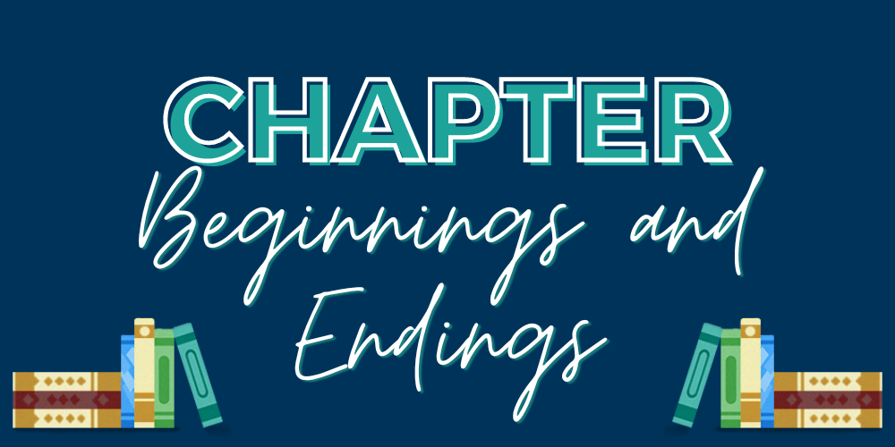

Hello, writers! October’s theme was about effectively opening and closing your chapters. Below are all of our tips for: Chapter Beginnings and Endings! 

Tip 1: **Open with action**—this doesn’t mean it has to be a literal chase scene level action! Simply that the character is doing something. 

Tip 2: Time warp! (Ok, ok time skip….) Jump us ahead in time to draw the reader in. You don’t have to start exactly where you left off. So long as it’s clear for the reader where and when they are, go for it! 

Tip 3: Give some sensory details! This not only will help with establishing place and give us some info on what the character is like based on what they notice, but also make where we are feel more real. 

Tip 4: Give the reader new information about either the main character or the plot. Whether it’s a twist or character growth, this can help with strengthening the beginning of a chapter. 

Tip 5: Be careful starting with dialogue—make sure you quickly ground readers. They need to know who is talking, who is in the room, etc. It can be a great way to start when the dialogue is gripping and not casual! 

Tip 6: On to endings! Use a cliffhanger! But do so sparingly, otherwise it will feel exhausting. And keep that cliffhanger focused on the main character rather than the villain or a side character. Readers will want to know what will happen to the beloved main character!

Tip 7: End at a natural stopping or pausing point—have they completed the mini goal they’ve set out to accomplish in the chapter, for example? 

Tip 8: Have someone unexpectedly arrive. This way, the reader will be just as surprised and curious as the main character. 

Tip 9: Create some kind of mystery for the reader, whether it’s through use of a question or setting up a curiosity for the reader to explore in the next chapter, it’ll make them wonder! 

Tip 10: Give the reader the “oh no, now what?” moment through either an awful choice the character faces (but doesn’t yet make) or the character realizing they’ve made one heck of a mistake. Make readers need to know what’s next.

Thanks for joining us for our review of October’s tips, writer friends! We’ll be back in November with more tips!