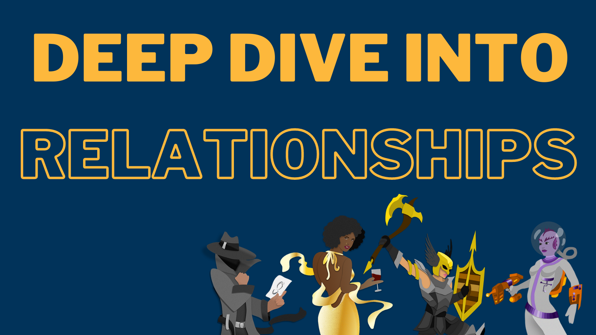

November’s theme was a **deep dive into relationships**. Read on for tips around the relationships between your characters and questions to consider when both building their backstory and the story that’s unfolding. Before diving in any further, we’d like to put in a content warning that abuse and neglect are briefly discussed below. 

**Relationships fill your main character’s (MC) life and that impacts how your character interacts with the world around them—both those on the page and off**. They can be positive or negative influences on your character. 

**There are many types of relationships to consider when writing the social aspects of your MC’s life, from family and friendship to romantic and professional** (this includes students and how they interact with teachers and peers). We’d argue there’s one other one: the always acquaintance you’d miss if they were unexpectedly gone, like your favorite barista who knows your order before you even get to the bar or the neighbor you wave to and say hello, but don’t hang out with.

Now, let’s break down the specific relationship types and how they may affects your MC. First, we’ll start with family, whatever that may look like for your MC. For this discussion, when we say family, we’re talking about early life family rather than found family that can happen later in life. Even if none of your MC’s family is alive anymore at the time of your story, **family is the first place we build connections with others**—it’s the literal building blocks of how we navigate relationships. Rarely are we there at the MC’s birth, but those early bonds are important for you as a writer to have at least an idea of even if we never see it. Were their needs met early on? If yes, they’ll likely have greater success in connecting with others—don’t worry, there can still be tension and struggles with relationships for your MC despite this. If not, it can bloom into a variety of challenges for the MC for their entire life (but more on that later). Questions to ask yourself regarding family include: does your MC keep contact with their family, or have they cut ties with them completely? Do they dread the holidays? Do they have a relative they’re always competing with or that they absolutely adore? That can tell us about their familial relationship without digging into a full backstory if you don’t want to dig that deep.

**Unlike most instances of family, friendships are ones your MC chooses**. They may not make the best choices of who their friends should be (a possible point of tension—yay!), but still are connections. Found families and platonic relationships can bloom from here too. Who does your MC choose to surround themselves with? Are these relationships positive or negative for your MC? Are they actively avoiding certain friends or even all of them? Do they feel pressured by their friends? Friends may be the secondary characters that surround your MC throughout the story the most, so knowing who their friends are and what they’re like could help flesh out your entire story, not just your MC, especially if friendships are an important part of it.  

Pretty much any genre in YA and beyond can have romantic relationships in them. These relationships might start from friendships—this could be part of the story you’re trying to tell or could be part of backstory that’s not much touched on—**but they have a level of intimacy that differs from what’s found in friendship and platonic love**. Things to consider for your MC and any romantic relationships they may be in are what stage of the relationship are they in (i.e. beginning vs. have been in it for a while will look different)? Is this a positive relationship or negative? Is your character actively trying to get out of the relationship? Have they fallen out of love with their current partner? If so, they may want to fall back into love and they’ll either fail or succeed. Is this an on-again, off-again relationship? Will your story have a happily ever after?

Professional relationships are exactly what they sound like. They’re the people your MC works with or, for younger MCs, who they go to school with. **Professional relationships aren’t only for the contemporary stories**—the Fellowship of the Ring didn’t start out with everyone as friends. They were colleagues first! Just like the other relationship types, professional ones can be positive or negative. Positive ones could lead to work friendships or the school friends your MC only hangs out with while at school. Negative ones can be another avenue of potential stress and tension on your MC. Do they hate their boss? What about a particular co-worker who is always on them about something, or a bully in the school? 

Okay! Onto ways that you can fold relationships into your story:

**Like in real life, your MC may face a change or loss of an important relationship, whether it is through death, broken trust, or conflict, it leaves a mark on the MC**. If we’re seeing the change or loss as part of the story, this could be a major point of tension or even a major beat in the story. If it’s something that happened before the story, it could be a wound impacting the character. That said, some relationships may change within the story. It can be one that’s an ultimate change for the better that results in a stronger relationship between the MC and the secondary character.

**Alright, let’s talk wounds, and how negative relationships can lead to said wounds. Often characters have some kind of wound they’re working toward overcoming (whether or not they succeed is for a different month’s tips!)**. Examples of relationship-specific wounds include neglect or abuse in childhood by family, divorce, extramarital affairs, toxic relationships, and such forth—many of these lead to false beliefs about oneself (i.e. “I am unlovable” or “I am a bad person because…”), mistrust in others that may extend to the belief that people are only out there to use you, or even an eager need to please others for acceptance. 

**Just as there can be negative relationships, there are also positive relationships**. Positive relationships can help foster resilience in your character because they will have someone to lean on. They can also challenge your MC (in a good way) around their false beliefs about themselves. Many stories of character growth and change have a positive person who lifts the MC up or who is always there to go to bat for the MC.

Last month we shared tips on Spooky Atmospheres and Moods. Please check them out on Twitter [(@FromCarly)](https://twitter.com/FromCarly?target=_blank)  or Instagram [(@BookLightEditorial)](https://www.instagram.com/booklighteditorial?target=_blank)! 

Next month’s theme is **Pros and Cons of Points of View (POV)**. Tune into Instagram and Twitter. See you in December!