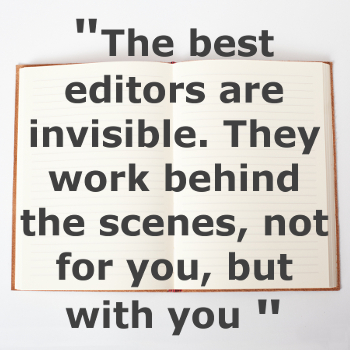

#### [by Laura Dennison](http://booklighteditorial.com/team#laura)

At long last, you’ve done it. You’ve written your novel. You’ve slugged your way though some 80,000 words and consumed approximately 80,000 cups of coffee in the process. When you’re stuck in a traffic jam on the way home from work, you have conversations with your characters. They even make regular appearances in your dreams. By now, you’re probably feeling ready for the next step. But what, exactly, should that next step be?

In short, you’ll need to edit. But before diving in, you’ll need to consider where you’re at in terms of revision. Have you just finished furiously pounding out your 110,000 word, realistic dystopian YA novel, _Life After 45_ in a matter of weeks, or is this your polished MFA thesis, _The Many Colors of Existential Dread: Excerpts From My Diary, Part Five_, which you’ve workshopped with peers and conferenced with professors over countless times?  Once you’ve gauged where your work is along this spectrum, you can decide the level of editing it currently requires.

Developmental editing, copyediting, and proofreading are three distinct **levels of editing**. They each have different focuses, and they each go into varying levels of depth in terms of types of changes. If you’re unfamiliar with the differences, don’t fret—I’m about to break it all down!

#### Developmental Editing

Developmental editors focus on content. If the editing world were analogous to a Dilbert-like, cubicle-laden office environment, developmental editors would serve a project-management role. They focus on the big picture and help you mold the malleable bits of your novel into a story with solid structure. A developmental editor can help you patch up plot holes; offer opinions on chronology, point of view, and pace; and provide tips to bring your characters to life, just to name a few. They might point out scenes that might be served better in summary, point out passages that are lacking in tension, or flag distracting instances of head-hopping.

!!!!! #### "You’ve slugged your way though some 80,000 words and consumed approximately 80,000 cups of coffee in the process."

Developmental editing is comprehensive. You can expect your manuscript to be returned to you with plenty of comments and queries (questions from the editor to the author) in the margins. These notes are typically made using track changes, a program built into Word processors. Often, developmental editors will also provide an editorial letter. This letter will help you determine what’s working well in your novel so far, as well as any suggestions for potential rewrites of scenes or areas of weakness to be aware of when it comes time to revise. If you want to learn more about these substantive editors, check out Book Light Editorial’s post on how [developmental editing is your book’s best friend](http://booklighteditorial.com/blog/developmental-editing-your-books-best-friend).

 
#### Copyediting

If you’re looking to hire a copyeditor, wait until you’re completely confident with the content of your draft, since any major rewrites would require another round of copyediting. That’s because copyeditors scour manuscripts for any issues related to spelling, grammar, usage, style, and consistency. These changes, which are mostly objective in nature, are standard to any copyedit and sometimes referred to as a **light copyedit**. A **heavy copyedit**, on the other hand, wades into more subjective waters, and includes a check on any awkward sentences, repetitive phrasing, or wordy paragraphs.

{.float-left}

As a copyeditor, I’m obligated to plead my cause here: We’re much more than warm-blooded spellcheckers. Yes, computers can point out errors our humanoid eyes tend to easily gloss over, but they’re prone to their own careless mistakes. Did Jen _definitely_ stare into the solar eclipse, or did she _defiantly_ stare into it? Is Leo studying public healthcare at college in the fall, or something a little more . . . specific? Simply running the spelling and grammar check on your Word processor is just a start. 

Copyediting also requires a human touch when it comes to maintaining consistency, and when a novel spans hundreds of pages, that’s no small tasks. Consistency applies to both details about your characters and their world _and_ the rules of grammar and style, so let’s get the dry stuff out of the way first. Before copyediting, you should know which dictionary (_Merriam-Webster’s_ is considered the gold standard) and style guide you’ll be comparing your text against. A **style guide** is a collection of set standards for writing. Most often, fiction writers use the _Chicago Manual of Style_. Within the guide, you’ll find the answers to all life’s most burning questions: Should I spell out the word _three_, or use the numeral? Is it the _Treaty of Versailles_ or the _treaty of Versailles_? Do I use the Oxford comma?

Consulting a style guide and set dictionary takes out a lot of that guesswork when it comes to these matters, but the truth is, whether Clyde gets an _X-ray_ or an _x-ray_ of his broken wrist is less important than whether the _X_ remains capitalized for the length of the novel. At best, these types of inconsistencies annoy the reader. At worst, they can make your writing seem sloppy or unprofessional. Keep in mind that, especially with creative writing, these guidelines are just that—guidelines. They’re not meant to be a set of rigid rules replacing common sense. After all, that’s what computerized grammar checkers are for!

Beyond the universal, it’s important to keep track of all things unique to your novel. To stay organized, copyeditors use a **style sheet**. This document should include information like the names and correct spellings of your characters, any unique locations, and any other relevant details that the editor should be on the lookout for, such as notes on characters’ physical appearances. This way, if Timmy’s eyes are described as “icy and cold—a chilling, glacial blue” on page 57, but “dark as an oil slick” on page 78, it’s much easier to notice the inconsistency and quickly work to resolve the problem. Style sheets are particularly important if you’re writing a science fiction novel that features the Jelopaticks—a blob-like alien species who live on planet ZeeZoo’Kap and travel through space in their Bleep-Bleep M-875 personalized rockets—as we can’t simply Google Jelopaticks to verify the spelling, since, of course, they don’t exist . . . yet. 

!!!!! ### "We’re much more than warm-blooded spellcheckers."

Copyeditors also use in-line comments and track changes for providing feedback. With a heavier copyedit, you can expect your manuscript to return to you with a healthy amount of markups and a fair number of suggestions, but don’t expect a three-page editorial letter to arrive in your inbox alongside it. With the exception of some queries, most copyedits should be straightforward enough to either accept, alter (as in, deciding whether Timmy’s eyes should be Gatorade blue or oil-rig brown), or _stet_ (let sit).

#### Proofreading

If editing were a Subway line, proofreading would be the last stop on the long, sometimes squeaky ride to Published Town. Proofreading is a read-through of your novel to ensure there are no typographical errors. By typographical errors, I mean really granular, tiny things—think _being_ instead of _begin_, _shipped_ instead of _sipped_. It’s an extra space between sentences or a period that’s secretly slithered its way outside the confines of its closing quotation marks.

Oftentimes, authors think their work is ready for proofreading and skip the crucial step of copyediting, so be sure your prose is polished, tight, and in need of no further tweaking before you pursue a proofread. Consider the moment you check for back pockets for your wallet, keys, and phone one last time before leaving for work in the morning. It’s an important check, because if any of the basics are missing, you’re going to waste a lot of precious time backtracking. 

#### A Word On Changes

I know it can be scary to plunk your newly minted novel into the hands of an editor, and it is totally, entirely valid to feel protective or worried about the changes an editor might suggest. Will I get my pages back only to find that everything’s been rewritten in the stiff, academic voice of a tenured professor of neuroscience? Will they change my main character’s name from Eric to Randy just because their high school boyfriend—coincidentally also named Eric—was a really slobbery kisser?

These concerns are natural. They show that you’re committed to your work, and it’s commendable that, despite these fears, you’re seeking out the next steps. Know that, despite the level of editing, it’s never the editor’s job to alter your voice, rewrite your work, or make changes based solely on preference without consulting you or without a reason to back them up.

I was a writer long before I started professionally editing, so I empathize with authors’ fears and fretted I’d alter their voices. My boss provided me with some helpful advice that boils down to this: The best editors are invisible. They work behind the scenes, not _for_ you, but _with_ you. This way, come showtime, the spotlight shines right where it should—on your words and your book.

##### Happy writing!
