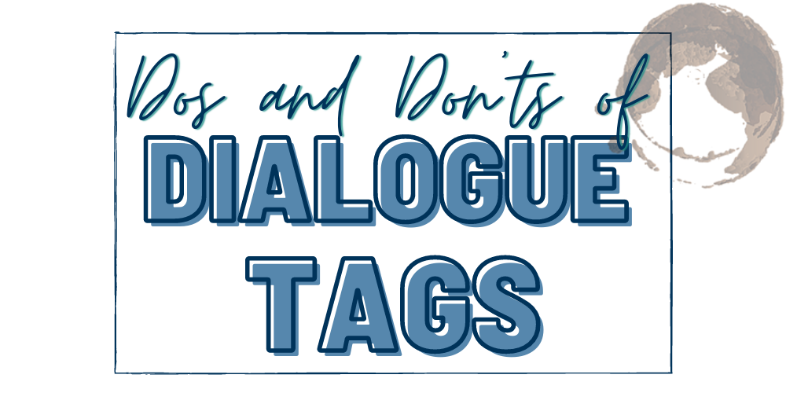

It’s that time again—a new theme! This month we covered “Dos and Don’ts of Dialogue Tags!” This month we're keeping it simple, here is your list of dos and don'ts to keep handy whenever you're questioning what to do!

* **Do be sure to let us know who’s talking early on**. The character’s name or I/she/he/they said goes a long way. Ask is ok too. 
* **Don’t tag every line of dialogue**. Yes, we need tags in the beginning, but character’s speech patterns and actions outside of dialogue should help us know who is speaking. Also use it when a new character enters the conversation. 
* **Do filter who is talking through action or body language** like: 
 * Sam jabbed the doorbell with her thumb. “I hope they’re still home.”
* **Don’t go overboard with unique tags** like questioned, declared, yelled, etc. It’s OK sprinkled throughout the novel, but when they’re overused it gets distracting for readers. 
* **Do feel free to have a tag placed at the beginning, middle, or end of a sentence**. It doesn’t have to only be at the end! 
* **Don’t have characters using each other’s names or roles in every other sentence** to tell us who is there unless this is a cultural norm. 
* **Do be sure to format dialogue tags correctly**:
 * “This is the weirdest ice cream I’ve ever had.” She said. (Incorrect)
 * “This is the weirdest ice cream I’ve ever had,” she said. (Correct)
* **Don’t go adverb happy with your tags**. We don’t need to be told he said something excitedly, etc. Show us! 
* Remember, **dialogue tags are there to help us know who’s talking**, the I/she/he/they said may seem like a bore, but it serves a quick function for the reader so they can focus on your wonderful story. 

Thanks for reading, writer friends. We’re glad you came! Keep on creating, you’re doing great. 
