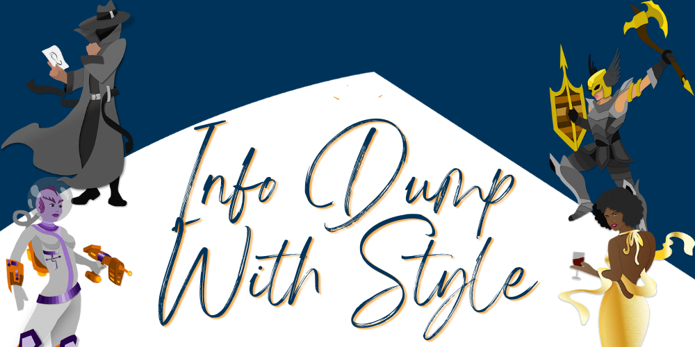

At the end of the day, a novel is just an exercise in sharing a bunch of information with your reader. Oof, that oversimplification doesn't make reading seem like a fun activity, does it? Here are 9 tips that will make the info-dumps an entertaining pastime for your reader:

**Tip 1:** Info dumps can show up in narrative or in dialogue, and can be about setting, plot, emotions, or character. They sneak into your novel, so be wary of scenes about sharing information. 

**Tip 2:** Placement matters: share info too soon and it will feel irrelevant, share it too late and it will feel convenient. 

**Tip 3:** While explaining stuff to the reader, share *why* the information matters to your character. Color it with your character's opinions.

**Tip 4:** Make sure the information is shared as part of a scene's action whenever possible. 

**Tip 5:** Don't explain stuff that the protagonist should know. Instead, let the reader absorb that information through immersion in a story. 

**Tip 6:** Don't feel the need to explain everything: readers don't need to know all the details and they'll have fun connecting the dots.

**Tip 7:** If you have chunks of information the reader absolutely must know, play around with length! (Can you say it in one sentence instead of a full paragraph?) 

**Tip 8:** Still feel like you're dumping too much? In a separate draft, delete all the chunks of dry information. Let it sit for a few days then go back to it. How much do you need to restore? Probably not all of it! 

**Tip 9:** Imagine your reader hates long explanations and covers their eyes every time it shows up on page. How can you sneak useful information to them in a way that's entertaining? 

!!!!! Of course, even once you master the art of info-dumping with style, it can still be difficult to recognize info-dumps on your own and to determine what information the reader actually needs. We recommend finding a second pair of eyes to help with this while revising your novel. Check out our [services page](/services) if you're interested in hiring Book Light Editorial to help with info-dumps and more!  
