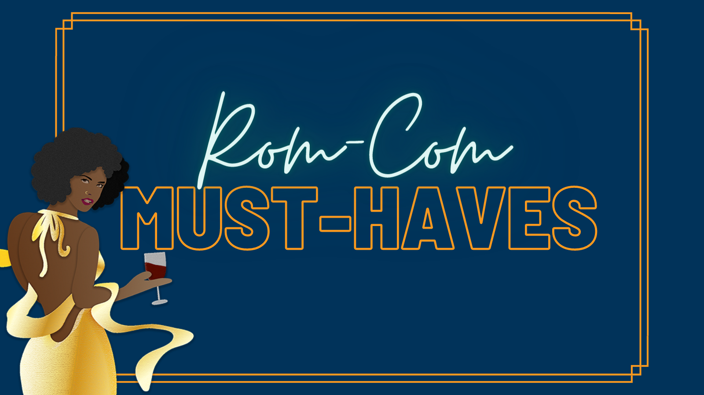

The New Year’s been all rung in and we started it with a new theme! Our wonderful voters picked Rom-Com Must-Haves (and some Maybe-Haves). Keep reading for our recap!

Who are the protagonist(s) and love interest(s) we’re rooting for? Establish this early on too. **Don’t forget to give us the why around their need to find love**—bad break up? Pushy parental expectations? Loneliness? Whatever it is, let us know.

The big **“meet cute”** moment is another Rom-Com must and boy does it need to be a memorable one. It’ll stick with your characters as much as it does with your readers. It’s also the catalyst in the story.

**The bestie who knows best** is yet another must. This secondary character (or even group of characters) may be a relative too, but is someone who often tells it like it is to the main character and who can really see what’s going on even if the main character can’t. The bestie may be the complete opposite of the main characters as well to amp up the comedic aspects of the story.

Don’t forget to **give us some humor!** This could be a good place where the fun and games come in beat-wise. In movies, it’s often a fun montage of the main character and love interest doing all kinds of ridiculous together while falling in love. Do this in your story too. Have fun with it! Give us the feel-goods and laughs.

**The misunderstanding**, miscommunication, or all around whoopsie that makes it seem like this relationship won’t work out. This could be where a wandering ex shows up and seemingly ruins it all, for example. This is the climactic moment of the story.

Some Rom-Coms employ the **red herring** love interest to increase the tension—the readers know the red herring isn’t the real love interest, but this is how the main character realizes who they’re meant to be with because this red herring isn’t as perfect as they seem.

Many Rom-Coms also have some huge gesture of love often as an apology for the earlier misunderstanding, and we’re here for it. Get us grinning. Who cares how ridiculous the gesture might be, we’re here for it.

Don’t forget that **happy ending**! This is a Rom-Com, not a drama, so it’s got to end on a happy note. This doesn’t mean the main character and love interest have to end up together, though! Maybe they’re friends and the main character has found a happiness they haven’t had either ever or in a long time. Obviously, the ending can also be the grand finale kiss. Whatever it may be, give us those warm and fuzzies.

As a final note for Rom-Com Must-Haves, whatever the ending may be, keep your characters true to themselves and their goals. **Avoid the main character or love interest giving up their goal/career/etc.** for the other person. It’s an old trope that often has the female lead being the one to give it all up for love.

Rom-Coms have become very versatile and more inclusive over the years and can be about platonic love like in _Bridesmaids_ where it’s about the love between friends. Give a Rom-Com a try friends. Write your hearts out and we hope you have fun! Thanks for joining us.