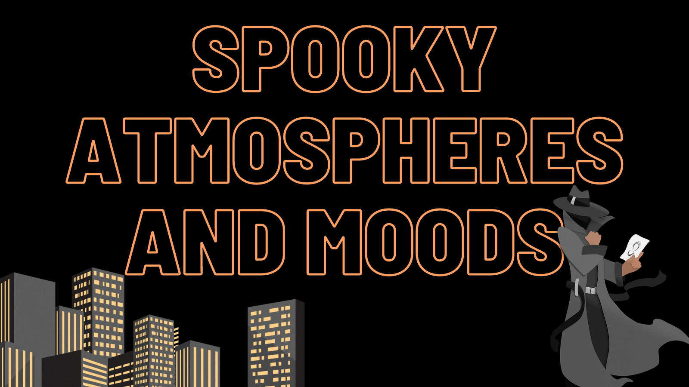

The spooky season is upon us, so what better time to talk about ways to spookify your writing? October’s theme is all about how to **create spooky atmospheres and moods**. 

When trying to layer your world with creepiness, **vocabulary choices matter**! They help to set the tone (i.e. words like tip-toe, slink, and rattle vs. stroll, skip, and chime). Consider making yourself a list of words to fit your spooky mood. 

How you use your characters can also impact the mood of the story—what's their temperament, how do they react in scary situations (that’s right, show us darn it), etc. Another important thing to remember about your characters is **if they aren’t scared, we won’t be**. Dialogue can further the sense of mood and can be a powerful tool for the writer. Take, for example, how dialogue differs when a character is trying to stay hidden from a monster as compared to chilling in a coffee shop with a friend.

**Setting is just as important as who your characters are**. Use setting to build mood—_The Shining_ didn’t take place in a homey bed-and-breakfast filled with cheer for a reason. Also, don’t forget the weather! Spooky stories are rarely filled with rainbows and sunshine. That said, it can be fun to subvert expectations around setting if some aspect of an otherwise typical place is just off-kilter and unfolds further and further into the abnormal.

Ratchet up the stakes. **Create a sense of hopelessness for the reader**—it can be tied to atmosphere or character, or both. Make us fear for the character’s survival, whether it’s literal death or loss of the character’s humanity, make us worry. Bringing back _The Shining_ as an example, it’s a hotel that literally gets cut off from the rest of the world during the winter. Leaving would likely lead to death simply because of the weather.

**Use all five senses** to draw in the spook factor. The more immersed you can get us, not only how the world looks, but also sounds, the way it feels at the main character’s finger, and how it smells and tastes makes it all the richer and more realistic feeling. We often focus so much on the sense of sight that we miss out on the other senses!

Pacing is an effective tool for putting your reader on edge. To do so, you need to **balance fast and slow moments**—your main character can’t always literally be running away from the monster. That’d be no fun for the reader. Add in those slower moments to give your reader a breather from the intensity while also allowing for their dread of what’s coming to build in the reader’s mind. For high tension moments, shorten your sentences to keep the pacing fast. Slower pacing looks like flashbacks, longer sentences, and moments of introspection. 

**Consider what your theme is.** Many horror or creepier novels have themes that revolve around death, the afterlife, monsters, demons, the unknown, or evil spirits and spooks. Lives or souls or even the main character’s humanity are what’s at stake within these themes.

Finally, think about **what people are afraid of**. Spiders, the dark, a fire, claustrophobia and being trapped—inject some of that into your story! Prey upon your reader’s fears. It’ll be a perfect addition to establishing your mood.
