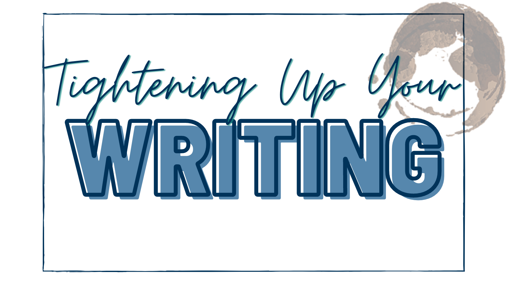

## Goodbye February! The month’s theme was Tightening Up Your Writing. Let’s review the tips.

We started off with one that many of you have likely heard: **cut those unnecessary adverbs**. Use strong verbs to replace the weak verb that’s paired with the adverbs. Sure, there may be times when an adverb is called for and that's totally ok, but use them intentionally, not all willy-nilly! 

One simple trick to tighten your writing and aid in pacing is to use contractions. Contractions also help your story feel more approachable and less formal. 

!!!!! Which is more personable: 
!!!!! * I would like to grab coffee with you. The cafe is not far from here. 
!!!!! * I’d like to grab coffee with you. The cafe isn’t far from here.  

Another tip that may not surprise some of you: **watch out for those adjectives**. Ditch extraneous ones—they don't always help. Yes, adjectives can be useful in writing, but use them wisely. Here’s an example: The small cat roamed the street. Most cats are small. We aren't talking lions here because you’d say as much, so ax the small. Now if the cat were unusually large, that adjective would make more sense. 

Give credit to your reader’s intelligence—**avoid stating the obvious**. If we say a character is waving, do we need to say they raised their hand to wave? Nope! That’s how people wave. Unless they’re waving unusually, like with a box of cereal, we don’t need to know their hand went up. Same goes for telling us the character’s emotion: He cried in sadness. Do we need the “in sadness?” Not at all. Usually people cry when they’re sad! 

**Cut those dreaded filter words**. They put space between the reader and the MC. Don’t tell us the MC hears, feels, sees etc., show us! 

!!!!! Here’s an example, compare and see what you think: 
!!!!! * She hears the bell ring. She panics. Class will start soon. 
!!!!! * The bell rings. Crap! Class starts, and soon. 

One is tighter and gets closer to the MC, right? Bonus to there typically being fewer words when you nix the filters. 

Reword sentences to **get rid of passive voice**—sometimes there’s no way around it, but when there is, choose the stronger option and do away with passive voice. The “was” word can be a tricky one too. Was isn’t inherently bad and you may need to use it, but do so for a reason. 

Here’s a quick example of strengthening your sentence: She was walking. Vs. She walked.  

Unless you’re writing non-fiction or have a particularly stuffy character, **avoid the big fancy words** that leave readers needing to go look it up. One dropped in here or there is fine, but if your reader needs a thesaurus to get through your novel, that’s a problem. More familiar and common words increases accessibility to the reader. 

Look for any instances where you’re being redundant in your writing and **give it an axing**. Likely one phrase or word choice is more evocative than the other anyhow, so getting rid of the unneeded repetition strengthens your writing while also tightening it! This is different than intentional repetition some writers use throughout their story with regard to a theme or specific element in their story.

And for our last tip, we suggested you avoid “in order to,” “start to,” “that,” “currently,” “really,” “very” moments when they are unnecessary—which is often. Same goes for starting your sentences with “there is” or “there are.” 

!!!!! Here’s an example: 
!!!!! * She started to work on her homework.  
!!!!! * She worked on her homework. 

See? Simple!

Thanks for joining us for our recap of February’s tips. See you next month! And writers, keep being awesome.