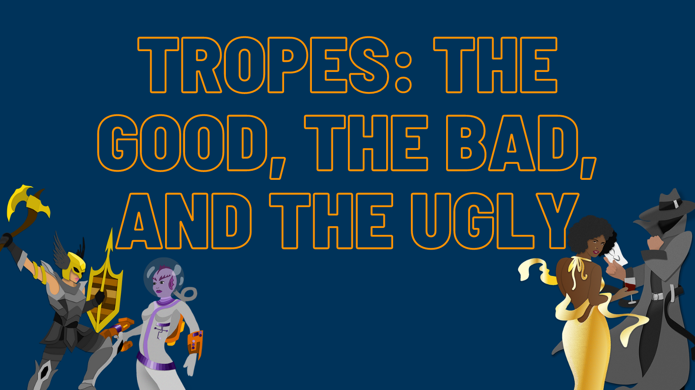

Hey there writers! March has come to an end which means it’s time for our theme of the month blog post! Throughout March we talked all about Tropes: The Good, the Bad, and the Ugly. March also brought us further into RevPit, and the month ends with an #AskEditor event! 

Right, let’s get to it. What exactly are tropes? Well, **they’re literary devices that are familiar to the reader and typically easy to recognize. This includes themes, characters and relationship types between characters, plot devices, etc.** Generally speaking tropes are neither good nor bad—when used effectively—but some are harmful (more on that to come). They also aren’t only used in novels—movies, TV shows, video games, etc. use tropes. We’ll be sharing some examples below, please note that these are not exhaustive lists.

With the basics out of the way, let’s dive into what makes a “good” trope. **Execution is a big part of what makes one good—how uniquely you can approach it**. There are other tropes out there that aren't as overused or ones that consistently have readers wanting more.

Examples of “good” tropes: 
* Found Families 
* Slow Burn Romances 
* Villain Redemption Arcs (or at the very least, well-rounded villains) 
* Villain POVs

“Bad” tropes are the overused, the tired, and/or clichéd ones. We’ve all seen and know them—they’re the tropes you can pick out almost immediately and know exactly how the story’s going to end. They're predictable to a fault.

Examples of “bad” (overdone or cliché) tropes: 
* Love Triangle 
* Chosen One 
* From “Ugly” to Prom Queen 
* Insta-Love 
* Dreams—opening with one or ending with “it was all a dream” 
* Damsel in Distress Female Lead 
* Mary Sue

Absolutely love a trope on the “bad” list? Not all is lost! **You can take one of those tropes and make it fresh in a whole new way so it doesn’t feel clichéd or overdone**. Use those creative juices of yours. Subvert expectations (in a way that fits within the story—don’t Shyamalan us, be more like Mel Brooks in Spaceballs) and surprise us. Here’s a quick ridiculous example, say you love the Chosen One trope. What if the prophecy got it all wrong, and it’s actually a chosen dog and now everyone has to protect that doggo on their journey to Mt. Scary to defeat the big bad? Who knows! Be creative!

There are tropes out there that just plain hurt groups of people—these are the ugly tropes. **Ugly tropes are the kinds that are harmful, often to a specific subset of the population, and typically promote ideas that are negative and/or likely to hurt said population**. These tropes, at best, will make you seem like a lazy writer. At their worst, they’ll turn readers away from your work. It also further entrenches these hurtful ideas into our society.

Here are some examples of ugly, harmful tropes that you, dear writer, should plain not use: 
* Violence against a minority group and/or women to get your main character to take action (i.e. rape trope or killing off the BIPOC character(s)) 
* Aliens given characteristics of minority cultures—we don’t need more othering in the world, let’s fight against that (original Star Trek is a great example of what NOT to do with this) 
* Romanticizing relationship red flags (Twilight—we’re looking at you for this one)

**As writers, you have a lot of power through your creativity and imagination to make some amazing stories—yes, you’ll almost definitely use tropes and that’s ok—you aren’t a poor writer if you do**. There are a plethora of fun tropes to play with. But use your power for good, don’t include the ugly, harmful tropes. The world doesn’t need more of that. 

Thanks for stopping by to learn more about tropes!