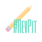
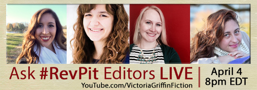

#### by Carly Hayward

###### Note: scroll to the bottom of the article for an update and a surprise!

By now you may have heard me talk about a fabulous new contest, Revise & Resub. If you haven't heard me talking about it, you are clearly ignoring all my tweets. I can't stop talking about it.

===

{.float-left}

For a full rundown of the contest check out my [previous blog post](/blog/first-revise-and-resub-contest) or check out the official contest [website](http://reviseresub.com/?target=_blank).

The other editors and I are hosting #AskEditor sessions where anyone can come and ask us the difficult questions (like would we rather live in Harry Potter's world or in Narnia). Or you can throw a few softballs at us (like what are the pros and cons of different point-of-views). Basically, you can ask us anything, preferably literature-related.

You can check out the full schedule [here](http://www.reviseresub.com/schedule?target=_blank). My chats are on April 1st at 1 pm ET and April 3rd at 7 pm ET. So mark your calendars!

And now for the **big surprise**: a few editors are hosting a live video #AskEditor chat on YouTube. That's right, we will be livestreaming an ask editor session. So come and talk to us and see our lovely faces. Our live chat is on April 4th at 8 pm ET.

Join us!: [Victoria Griffin Fiction](https://www.youtube.com/victoriagriffinfiction?target=_blank)

#### Update:

The live #AskEditor chat went well (when we weren't trying to figure out how to even do it)! You can now view it below:

<iframe width="560" height="315" src="https://www.youtube.com/embed/W8JYrjZyAAs" frameborder="0" allowfullscreen></iframe>
 