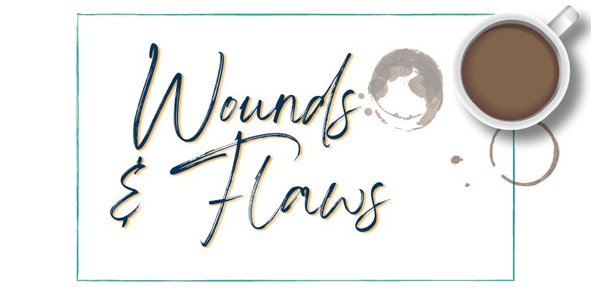

This month we focused on “Wounds & Flaws,” you’ll find our tips below.  

**Tip 1:** Definition time first! When talking about wounds, generally it is more about an emotional wound that establishes false beliefs in the character. Often negative false beliefs. These are lies the character tells themselves. 

**Tip 2:** A flaw is tied to a character’s weaknesses, limitations, or faults—it’s how they deal with their wound. It is *not* tied to a disability or physical attribute. Flaws can be changed through character growth. 

**Tip 3:**  Flaws and wounds help your characters feel more dynamic and add depth to your story. 

**Tip 4:** A character’s wounds will impact how they interact with the world and what they will notice about it. 

**Tip 5:** Understanding your character’s backstory can help you determine the wounds, flaws, and lies they tell themselves. 

**Tip 6:** Wounds often result from traumatic events, betrayals, childhood specific traumas, injustices, or failures. They happened off the page before the story starts. We can see the cause in a flashback, but it should have already happened. 

**Tip 7:** The internal arc of a story is the character facing their wounds and flaws and changing, failing to change, or stagnating in their attempts to change.

**Tip 8:** When a character changes their negative beliefs (the effects of their wound), healing begins and they are able to overcome their flaw. 

**Tip 9:** Certain genres tend to have certain types of wounds readers expect because they make sense within that genre. Do your research! 

!!!!! **Other Resources:**
!!!!! 
!!!!! [_The Emotional Wound Thesaurus: A Writer's Guide to Psychological Trauma_](https://www.amazon.com/Emotional-Wound-Thesaurus-Writers-Psychological/dp/0989772594/ref=sr_1_1?target=_blank) by Becca Puglisi and Angela Ackerman. Great resource for finding the ghost of your character's past. Less of a guide and more of a reference material
!!!!! 
!!!!! Story Chat Radio Episode: [_Shang-Chi and the Legend of the Ten Rings - Emotional Wounds_](https://www.storychatradio.com/shang-chi-and-the-legend-of-the-ten-rings-emotional-wounds?target=_blank). A podcast episode where two editors discuss emotional wounds and how they affect characters. They use the movie, _Shang-Chi and the Legend of the Ten Rings_, as an example. 

##### If your novel is finished and you're worried that the wounds aren't woven throughout the story or that the character arc isn't satisfying enough, remember that you don't have to go at it alone! At Book Light Editorial we love helping writers dig into their characters' wounds and flaws. Check out our [services page](/services) to learn more about how we can help! 
