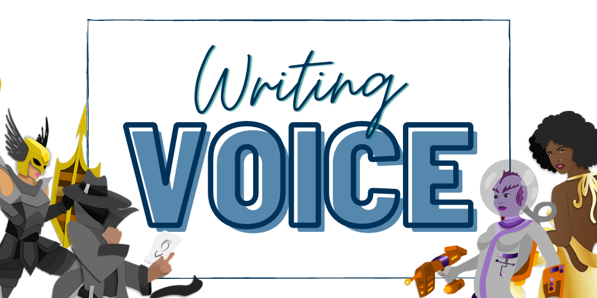

May has come and gone, but that doesn’t mean we didn’t have a theme! This month we shared tips on Voice. 

First thing to know, there are three types of voice in writing: author, narrator, and character. 
* Author voice = writing style 
* Narrator voice = the voice telling the story (i.e. POV)
* Character voice = the way your character thinks and speaks 

**Every character has their own way of talking, thinking, and seeing the world**—no two characters should describe the world around them exactly the same, just like in real life, no two people describe the world exactly the same! Piggybacking off of the prior tip, **what does your character notice first when entering a new place?** That can show readers an aspect of your character’s personality (i.e. do they look for books first? Exit options?).

**Your character’s current emotions will be reflected in the words you use as well as how you structure your sentences** (i.e. when your character is angry, the sentences will be short and choppy, etc.). Characters’ thoughts and feelings will tie into their actions and reactions and vice versa. The way they act and react should be true to who they are and how they feel. Please note, this is something that can change as they grow through the story!

**Word choice matters**. If you’re writing a children’s novel, the characters should think, act, and speak like kids, not adults (and yes, that means the kid characters will make “obvious” poor decisions at times as they are kids!). The opposite is true for adult novels: your adult characters shouldn’t sound like a ten-year-old. 

Effective use of voice often leaves your readers feeling like they are having a conversation with your character(s) because the character(s) feel real. They are unique and fully developed and like someone you could run into while out on a walk. 

How do you develop voice?: Write and then write some more. It can take time, and lots of words, before you get the hang of voice. Same goes for reading. The more you read, the more you’ll notice other writers’ voices. 

Final thoughts: voice is subjective, not everyone will like your character’s voice, and that’s ok. It’s impossible to please everyone. 

In April we shared tips on [Deep POV](https://booklighteditorial.com/blog/dos-and-donts-of-deep-pov). Please check them out on, our blog, Twitter (@FromCarly), or Instagram (@BookLightEditorial) to see what it was all about! 

Thanks for reading, writers. Keep on writing.

